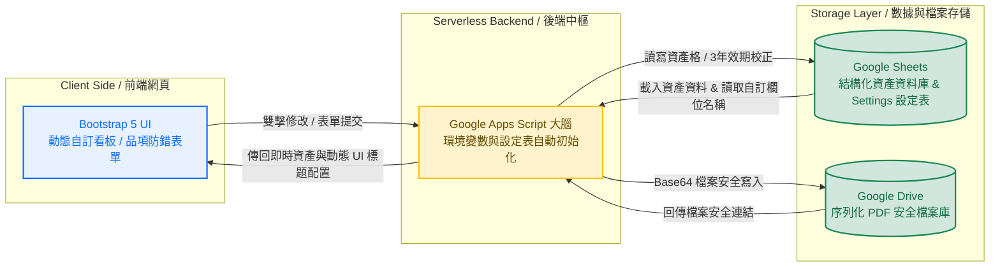

# **[Lab-SDS-Expiration-Tracker](https://github.com/jychen74/Lab-SDS-Expiration-Tracker)**

## 實驗室 SDS 效期自動化管理系統 (可自定義框架版)

### Customizable Serverless Asset & Compliance Lifecycle Tracker

A lightweight, zero-cost, and serverless Web Application originally inspired by research and medical laboratories, but fully optimized with high customizability to adapt to any compliance-driven workflow. Leveraging the integration of Google Sheets and Google Drive, this framework not only solves the regulatory necessity of tracking 3-year updates for Safety Data Sheets (SDS) but also offers a fully tailored environment. Without rewriting any code, users can instantly adapt this template to manage instrument calibrations, animal facility health monitoring reports, or IT security certificates.

這是一個基於實驗室需求所設計的輕量化、零成本管理系統，但不限實驗室管理使用，經優化的版本具有高度自定性，可滿足各種使用需求。本專案設計利用 Google 試算表與雲端硬碟，不僅能解決安全資料表 (SDS) 每三年需定期更新版次的勞安剛需，更具備完全自定義能力，可自由轉職為儀器校正、動物房監測報告或資安憑證管理系統。

---

## System Architecture / 系統架構

## Quick Start / 快速架設指南

> **No Coding Required! / 完全不需要懂程式碼！**
> You only need to click a few buttons to set up your own independent system.
> 您只需要點擊幾個按鈕，就能建立屬於您實驗室的獨立管理系統。

---

### 🌐 中文版架設教學

#### 步驟 1：建立系統複本

請點擊下方安全連結，將系統範本複製到您個人的 Google 帳號中：
👉 **[【點我立刻建立管理系統試算表複本】](https://docs.google.com/spreadsheets/d/1AZ8uN7qDuEBC6OBNbeNcrYt6IGBVJKlaJE3hgjCL_aw/copy)**

#### 步驟 2：一鍵自動初始化與資料夾建置

1. 進入您剛複製好的全新試算表， **請務必重新整理一次網頁（或按 F5）** ，工具列上方即會出現自訂選單。
2. 點選試算表上方工具列的自訂選單： **【🧪 SDS 系統管理】 -> 【⚙️ 初始化試算表欄位】** 。
3. **帳號授權放行** ：首次執行時 Google 會彈出隱私權警示畫面，請依序點選：
   * **「進階」** -> **「前往 shared_Lab_SDS (不安全)」** ->  **「允許」** 。
   * **指定 PDF 存放資料夾 (Folder ID機制)** ：授權完成後畫面會跳出對話框：
     * 💡  **新架設（無舊資料夾）** ： **直接「留空」並點擊「確定」** 。系統會自動在您的雲端硬碟根目錄生成一個名為 `【SDS_Upload_Folder】` 的新資料夾，並自動將其 ID 綁定到後台。
     * 💡  **移轉接軌（已有現成舊資料夾）** ：請直接將您現有的 Google Drive 資料夾 ID 貼入對話框並點擊「確定」，系統會自動對接，不需重複建檔。

#### 步驟 3：發布您的管理網頁

1. 在試算表畫面上方工具列點選 **【擴充功能】 -> 【Apps Script】**。
2. 進入程式碼畫面後，點擊右上方藍色的 **【部署】 -> 【新增部署】**。
3. 點擊彈出視窗左上角的「齒輪圖示」，在選單中選取 **「網頁應用程式」**。
4. 畫面的參數維持預設，直接點擊右下角的 **【部署】** 按鈕。
5. **大功告成**：複製畫面最終產生的「網頁應用程式網址（URL）」，這就是您專屬的管理網頁了！將此網址提供給同仁即可開始使用。

---

### 🌐 English Deployment Guide

#### Step 1: Copy the Template

Click the link below to clone the system template directly into your personal Google account:
👉 **[【Click Here to Clone the System Template Spreadsheet】](https://docs.google.com/spreadsheets/d/1AZ8uN7qDuEBC6OBNbeNcrYt6IGBVJKlaJE3hgjCL_aw/copy)**

#### Step 2: One-Click System Initialization & Folder Setup

1. Open your copied Google Spreadsheet and **refresh the page (F5)** to load the custom menu.
2. Click the custom menu on the top toolbar:  **【🧪 SDS 系統管理】 -> 【⚙️ 初始化試算表欄位】** .
3. **Grant Permission** : Google will pop up a security warning for the first run. Grant permissions by clicking **"Advanced"** -> **"Go to shared_Lab_SDS (unsafe)"** ->  **"Allow"** .
4. **Configure PDF Storage (Folder ID)** : A prompt window will appear:

* 💡  **Brand New Setup** :  **Leave the text box completely BLANK and click "OK"** . The system will automatically create a folder named `【SDS_Upload_Folder】` in your Google Drive root and bind it instantly.
* 💡  **Legacy Migration** : Paste your existing Google Drive Folder ID directly into the prompt box and click "OK" to connect your legacy storage repository seamlessly.

#### Step 3: Deploy the Web Application

1. In your spreadsheet toolbar, click **【Extensions】 -> 【Apps Script】**.
2. Inside the editor, click the blue button on the top right: **【Deploy】 -> 【New Deployment】**.
3. Click the gear icon next to "Select type" and choose **"Web App"**.
4. Leave all default settings as they are, and click the **【Deploy】** button at the bottom right.
5. **Success!**: Copy the generated **"Web app URL"**. This is your exclusive laboratory dashboard! Share this link with your lab colleagues to start tracking.

---

## 📂 雲端硬碟資料夾 ID (Folder ID) 尋找與更新教學

本系統的前端網頁允許使用者直接上傳 PDF 檔案（如安全資料表、校正報告、健康檢測書）。這些上傳的檔案會序列化儲存至您指定的 Google Drive 資料夾中。

### 🔍 核心操作 1：如何準確找出「資料夾 ID」？

請放心，這非常簡單，只需要看網址列即可：

1. 打開您的 Google 雲端硬碟（Google Drive）。
2. 點進您 **準備用來存放上傳 PDF 的那個資料夾** 。
3. 看看瀏覽器最上方的 **網址列** ，網址最後面 `/folders/` 之後、長長的一串隨機英數亂數（如下圖所示），就是該資料夾的物理 ID

### 🔄 核心操作 2：如何變更或更新資料夾 ID？

當業務交接、年度歸檔，或是您想將網頁檔案改上傳到另一個全新資料夾時，系統提供了 **兩種極度友善的更新方式** ，完全不需要修改任何程式碼：

#### 💡 方式 A：使用試算表工具列「自訂選單」更新（最推薦、最直覺）

1. 回到您的系統 Google 試算表畫面。
2. 點選上方工具列的自訂選單： **【🧪 SDS 系統管理】 ➡️ 【⚙️ 更新資料夾 ID】** （或初始化選單）。
3. 畫面會直接跳出互動對話框，請直接 **將您剛剛複製的新資料夾 ID 貼進空格中** 。
4. 點擊  **「確定」** ，大腦就會自動完成後台綁定，前台網頁即時生效！

#### 💡 方式 B：直接修改 `settings` 工作表

1. 打開試算表下方的 **`settings`** 工作表分頁。
2. 找到 **`uploadFolderId`** 這一列。
3. 直接將新複製的資料夾 ID 貼進 **B 欄 (Value)** 的格子中蓋過去，網頁上傳目標便會瞬間完成通靈轉移。

---

## Customization / 進階自訂系統說明

本系統具備完全自定義與 White-label 能力。使用者可在完全不修改任何 HTML 與 GAS 程式碼的前提下，直接透過修改試算表內部的 **`settings`** 工作表，為網頁進行一鍵轉職：

* **轉職範例 1：醫療儀器校正管理**
  將 `sidebarTitle` 改為「儀器設備校正盤點」，`field1Name` 改為「儀器設備名稱」，網頁 UI 即自動變更。
* **轉職範例 2：動物房健康監控報告**
  將 `sidebarTitle` 改為「動物房監測報告登錄」，`field1Name` 改為「監測區域/代號」，即可完美適用。

---

## License

This project is licensed under the MIT License - feel free to use and adapt it for your lab!
本專案採用 MIT 開源授權，歡迎自由複製、修改並部署於您的研究機構與實驗室中！
