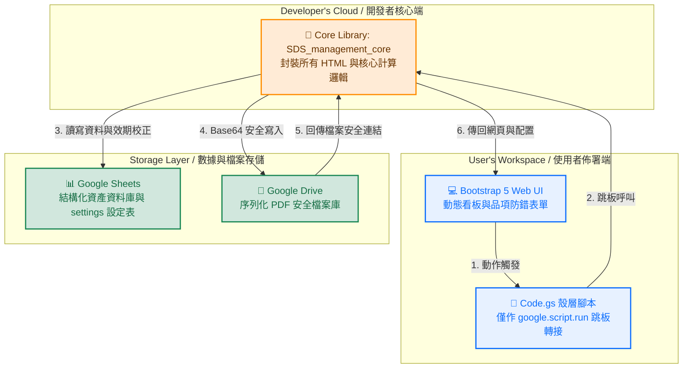

# **[Lab-SDS-Expiration-Tracker](https://github.com/jychen74/Lab-SDS-Expiration-Tracker)**

## 實驗室 SDS 效期自動化管理系統 (大腦端 Library 集中維護開源版)

### Decentralized Serverless Asset Tracker with Centralized Core Library

A lightweight, zero-cost, and serverless Web Application leveraging the **Google Apps Script (GAS) Library architecture**. This project balances IP protection, frictionless deployment, and high customizability. By splitting the codebase into a **Centralized Brain Library** (maintained by the developer) and a **Decentralized Wrapper Script** (cloned by users), laboratories can deploy their independent compliance tracking systems without touching a single line of core logic. Without any rewriting, this framework easily transforms into an instrument calibration tracker, animal facility monitoring repository, or asset compliance log.

本系統採用 **Google Apps Script (GAS) 程式庫 (Library) 專利架構** 進行全面重構。核心邏輯與前端網頁完全封裝於開發者的「核心端（Core Library）」中，終端使用者端僅需持有「殼層跳板（Wrapper）腳本」。此設計在確保核心技術不被外洩的同時，實現了使用者「零代碼複製、一鍵無痛升級」的極致體驗。本系統不僅能精準解決安全資料表 (SDS) 每三年需定期更新的勞安法規剛需，更具備完全自定義能力，可自由轉職為儀器校正、動物房監測報告或資安憑證管理系統。

---

## System Architecture / 系統架構




## Quick Start / 快速架設指南

> **No Coding Required! / 完全不需要懂程式碼！**
> Users only need to make a copy and click deploy to launch their independent app.
> 您只需要建立試算表複本並點擊部署，就能立刻建立獨立的管理系統網頁。

### 🌐 中文版架設教學

#### 步驟 1：建立系統複本

請點擊下方安全連結，將系統範本（內含空殼代碼與大腦庫連結）複製到您個人的 Google 帳號中：
👉 [【點我立刻建立管理系統試算表複本】](https://docs.google.com/spreadsheets/d/1SWycVPT7uGRBxx6U9GIHyY-XhMymFxv69YXHvJdzCLQ/copy)

#### 步驟 2：一鍵自動初始化與資料夾建置

1. 進入您剛複製好的全新試算表， **請重新整理一次網頁（或按 F5）** ，工具列上方即會出現自訂選單。
2. 點選試算表上方工具列的自訂選單： **【🧪 SDS 系統管理】 -> 【⚙️ 初始化試算表欄位】** 。
3. **帳號授權放行** ：首次執行時 Google 會彈出隱私權警示畫面，請依序點選：
   * **「進階」** -> **「前往 shared_SDS_management (不安全)」** ->  **「允許」** 。
4. **指定 PDF 存放資料夾** ：授權完成後畫面會跳出對話框：
   * 💡  **新架設（無舊資料夾）** ： **直接「留空」並點擊「確定」** 。系統會自動在您的雲端硬碟根目錄生成一個名為 `【🧪 實驗室 SDS 檔案庫 (自動建立)】` 的新資料夾，並將其 ID 自動綁定。
   * 💡  **移轉接軌（已有現成舊資料夾）** ：請直接將您現有的 Google Drive 資料夾 ID 貼入對話框並點擊「確定」即可。

#### 步驟 3：發布您的管理網頁

1. 在試算表畫面上方工具列點選  **【擴充功能】 -> 【Apps Script】** 。
2. *(核對步驟)* 檢查左側的「程式庫」區塊，應已自動包含 `SDS_management_core`。
3. 點擊右上方藍色的  **【部署】 -> 【新增部署】** 。
4. 點擊彈出視窗左上角的「齒輪圖示」，在選單中選取  **「網頁應用程式」** 。
5. **確認關鍵參數** ：

* **執行身分** ：管理網頁應用程式的使用者 (User deploying)
* **誰有權限存取** ：所有人 (Anyone)

1. 點擊右下角的 **【部署】** 鈕，並通過 Google 畫面提示的首次權限審查。
2. **大功告成** ：複製畫面最終產生的「網頁應用程式網址（URL）」，這就是您專屬的管理網頁了！將此網址提供給同仁即可開始使用。

### 🌐 English Deployment Guide

#### Step 1: Copy the Template

Click the link below to clone the system template spreadsheet directly into your personal Google account:
👉 [【Click Here to Clone the System Template Spreadsheet】](https://docs.google.com/spreadsheets/d/1SWycVPT7uGRBxx6U9GIHyY-XhMymFxv69YXHvJdzCLQ/copy)

#### Step 2: One-Click System Initialization & Folder Setup

1. Open your copied Google Spreadsheet and **refresh the page (F5)** to load the custom menu.
2. Click the custom menu on the top toolbar:  **【🧪 SDS 系統管理】 -> 【⚙️ 初始化試算表欄位】** .
3. **Grant Permission** : Google will pop up a security warning for the first run. Grant permissions by clicking **"Advanced"** -> **"Go to shared_SDS_management (unsafe)"** ->  **"Allow"** .
4. **Configure PDF Storage (Folder ID)** : A prompt window will appear:
   * 💡  **Brand New Setup** :  **Leave the text box completely BLANK and click "OK"** . The system will automatically create a folder named `【🧪 實驗室 SDS 檔案庫 (自動建立)】` in your Google Drive root.
   * 💡  **Legacy Migration** : Paste your existing Google Drive Folder ID directly into the prompt box and click "OK" to connect your legacy storage seamlessly.

#### Step 3: Deploy the Web Application

1. In your spreadsheet toolbar, click  **【Extensions】 -> 【Apps Script】** .
2. *(Verification)* Ensure `SDS_management_core` is correctly linked under the **Libraries** tab on the left sidebar.
3. Inside the editor, click the blue button on the top right:  **【Deploy】 -> 【New Deployment】** .
4. Click the gear icon next to "Select type" and choose  **"Web App"** .
5. **Verify Configuration** :

* **Execute as** : User deploying the web app
* **Who has access** : Anyone

1. Click the **【Deploy】** button and complete the authorization wizard.
2. **Success!** : Copy the generated  **"Web app URL"** . This is your exclusive laboratory dashboard! Share this link with your lab colleagues to start tracking.

## 📂 雲端硬碟資料夾 ID (Folder ID) 尋找與更新教學

本系統的前端網頁允許使用者直接上傳 PDF 檔案（如安全資料表、校正報告、健康檢測書）。這些上傳的檔案會序列化儲存至您指定的 Google Drive 資料夾中。

### 🔍 如何準確找出「資料夾 ID」？

打開您的 Google 雲端硬碟（Google Drive）：

1. 點進您 **準備用來存放上傳 PDF 的那個資料夾** 。
2. 複製瀏覽器最上方 **網址列** 中，`/folders/` 之後、長長的一串隨機英數亂數（如下所示）：

```plaintext
https://drive.google.com/drive/folders/1OWFeqKzxokW1AzI8jhW7E5cBhgLA3KD0ODYV
                                       └───  🎯 請只複製這一段長亂數     ───┘
```

## 🔄 如何變更或更新資料夾 ID？

當業務交接或年度歸檔時，本系統提供完全不需修改程式碼的變更方式：

* **方式 A：使用試算表工具列自訂選單（最推薦）**
  在試算表上方點選：  **【🧪 SDS 系統管理】 ➡️ 【📁 設定/更換雲端硬碟資料夾 ID】** 。將複製的新 ID 貼進對話框中點選「確定」，後台便會自動完成綁定，前台網頁即時生效。
* **方式 B：直接修改 `settings` 工作表**
  打開試算表內部的 **`settings`** 工作表分頁，找到 **`uploadFolderId`** 這一列，直接將新複製的資料夾 ID 貼進 **B 欄 (Value)** 的格子中覆蓋過去即可。

## Customization / 進階自訂系統說明

本系統具備完全自定義與 White-label 能力。使用者可在完全不修改任何 HTML 與 GAS 核心程式碼的前提下，直接透過修改試算表內部的 **`settings`** 工作表，為網頁進行一鍵跨界轉職：

* **轉職範例 1：醫療儀器校正管理**
  將 `sidebarTitle` 改為「儀器設備校正盤點」，`field1Name` 改為「儀器設備名稱」，網頁 UI 即自動變更。
* **轉職範例 2：動物房健康監控報告**
  將 `sidebarTitle` 改為「動物房監測報告登錄」，`field1Name` 改為「監測區域/代號」，即可完美適用。

## Maintenance & Zero-Downtime Updates / 零停機維護優勢

由於系統核心架構已移至中央核心庫（Centralized Library），未來的任何功能升級（例如 UI 美化、演算法優化、法規年限調整）：

* 終端使用者 **完全不需要重新複製代碼或重新發布網頁網址** 。
* 開發者在中央端發布新版本後，使用者端便會無痛、無感地在背景完成自動升級，徹底解決了開源系統後續維護零散、難以同步的痛點。

## License

This project is licensed under the MIT License - feel free to use and adapt it for your lab!
本專案採用 MIT 開源授權，歡迎自由複製、修改並部署於您的研究機構與實驗室中！
